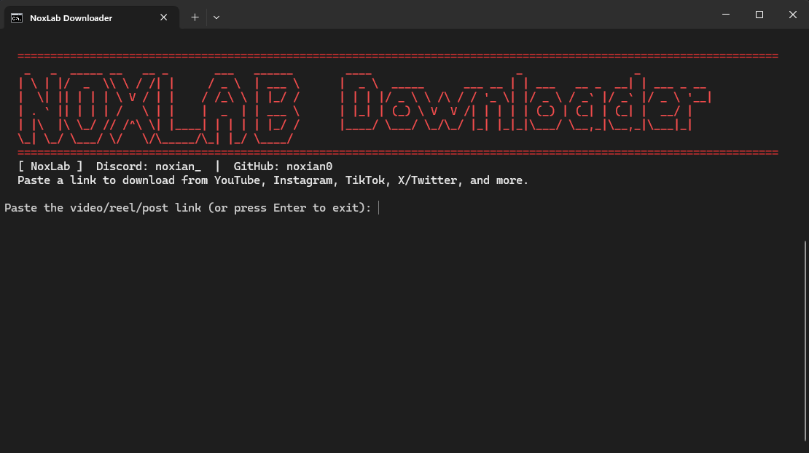

# NoxLab Downloader



NoxLab Downloader is a Windows app and command prompt tool for downloading
video or audio from links supported by `yt-dlp`, including YouTube, Instagram,
TikTok, X/Twitter, SoundCloud, and many other sites.

Downloads are saved in the `downloads` folder and are marked with `[NOXLAB]`
in the filename.

## Important

Use this tool only for content you own, have permission to download, or are
legally allowed to save. The author is not responsible for piracy, copyright
violations or any other misuse.
You use this tool at your own risk.

This project uses third-party software that is not owned by NoxLab:

- `yt-dlp`: the downloader engine. It reads the link, talks to the supported
  website, finds available media formats, and downloads the selected media.
- `imageio-ffmpeg`: provides access to an FFmpeg executable from Python.
- `FFmpeg`: merges video and audio streams, converts audio formats, and helps
  create playable files such as MP4 with AAC audio.

See [LICENSE](LICENSE) for the NoxLab Downloader license and third-party
notices.

## Setup

Python is required to use this tool. Install Python 3.10 or newer from:

https://www.python.org/downloads/

During installation, enable this option:

```text
Add python.exe to PATH
```

Node.js LTS is strongly recommended and is required for some YouTube videos.
Install it from:

https://nodejs.org/

After installing Node.js, close and reopen Command Prompt. You can check it with:

```bat
node --version
```

Run this once before using the downloader:

```bat
setup.bat
```

`setup.bat` does this on your PC:

1. Creates a local `.venv` Python environment inside the project folder.
2. Installs the required Python packages into that local environment.
3. Creates a `downloads` folder.
4. Creates a `NoxLab Downloader` shortcut on your desktop.
5. Creates a `NoxLab Downloader` shortcut inside the project folder.

The setup installs these Python packages:

- `yt-dlp`
- `imageio-ffmpeg`

It does not install the videos themselves, change your browser, or upload your
files anywhere. It only installs the dependencies needed by the downloader.

## Start The Tool

Recommended start method:

```text
NoxLab Downloader
```

Use the shortcut created on your desktop or inside the project folder.

You can also double-click the windowed launcher:

```bat
NOXLAB_DOWNLOADER.pyw
```

Command prompt mode is still available:

```bat
noxdl.bat
```


## Options

When using the app or command prompt mode, you can choose:

- video with sound
- audio only
- muted video
- resolution
- output format
- whether to use browser cookies for login-only links
- whether to download a full playlist
- an optional proxy for country/region-blocked links

For MP4 video downloads, the tool prefers M4A/AAC audio so the result plays
properly in Windows' built-in video players.

## Direct Commands

Download a 1080p MP4 video with sound:

```bat
noxdl.bat "https://www.youtube.com/watch?v=VIDEO_ID" --resolution 1080 --mode video --format mp4
```

Download audio only as MP3:

```bat
noxdl.bat "https://www.youtube.com/watch?v=VIDEO_ID" --mode audio --format mp3
```

Download a muted 720p MP4:

```bat
noxdl.bat "https://www.youtube.com/watch?v=VIDEO_ID" --resolution 720 --mode mute --format mp4
```

Use browser cookies, useful for some private or login-only links:

```bat
noxdl.bat "https://www.instagram.com/reel/SHORTCODE/" --cookies-browser edge
```

Opera GX cookies can be used with:

```bat
noxdl.bat "https://soundcloud.com/example/track" --cookies-browser opera-gx
```

Opera GX VPN only affects traffic inside Opera GX. It does not automatically
route Python, yt-dlp, or FFmpeg through the browser VPN. If a song/video is
country blocked, use a system-wide VPN or a proxy that affects all apps.

If you have a proxy URL, you can pass it directly:

```bat
noxdl.bat "https://soundcloud.com/example/track" --proxy "http://127.0.0.1:8080"
```

Show every format available for a link:

```bat
noxdl.bat "https://www.youtube.com/watch?v=VIDEO_ID" --list-formats
```

Update the downloader engine:

```bat
noxdl.bat --update-engine
```

## What It Does On Your PC

NoxLab Downloader runs locally on your PC. During normal use it can:

- create a `downloads` folder
- save downloaded video/audio files into that folder
- create a local `.venv` folder during setup
- create desktop and folder shortcuts during setup
- run `yt-dlp` through Python
- run FFmpeg through `imageio-ffmpeg`
- contact the website from the link you paste
- optionally read browser cookies if you choose `--cookies-browser` or select
  cookies in the menu
- read Opera GX cookies from your Opera GX profile when `opera-gx` is selected
- use a proxy if you provide one with `--proxy` or enter one in the menu
- allow yt-dlp to fetch its recommended YouTube JavaScript helper from GitHub
  when a JavaScript runtime is available

Browser cookies are only used if you choose that option.

## License

NoxLab Downloader is free to use, but it may not be sold, included in paid
software, included in freemium software, or reuploaded/modified without the
author's permission. See [LICENSE](LICENSE).
